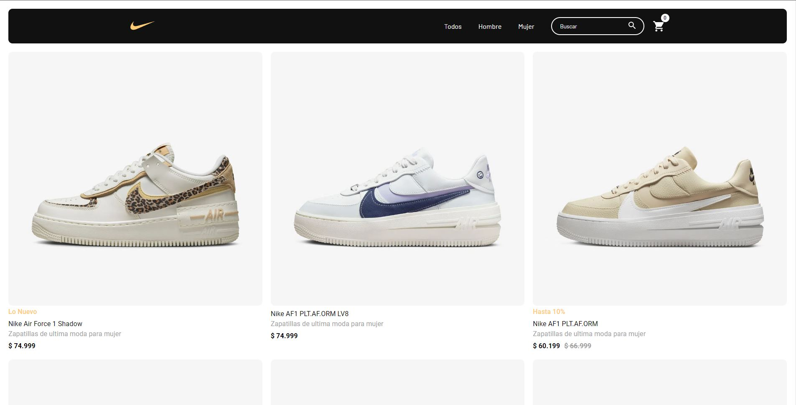
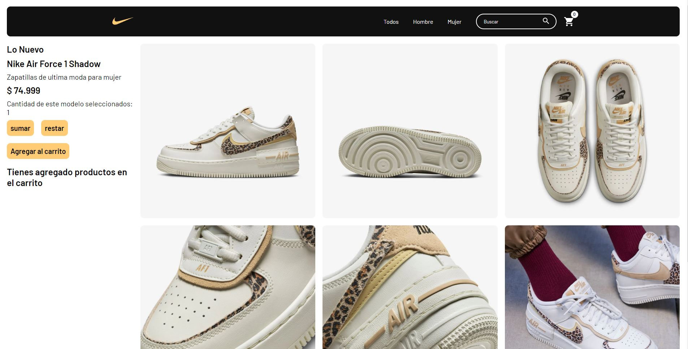
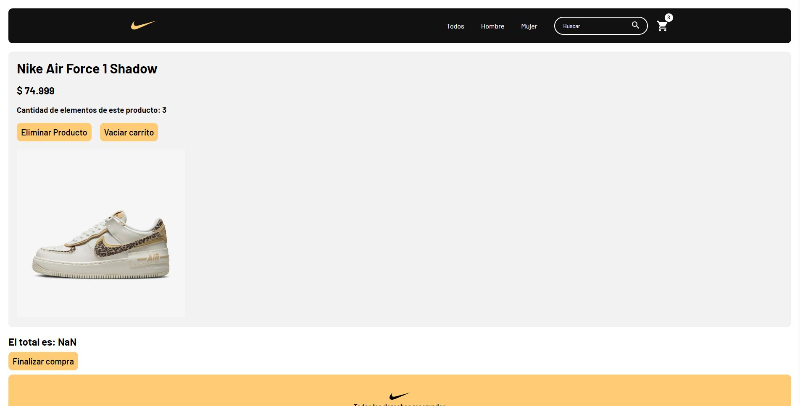
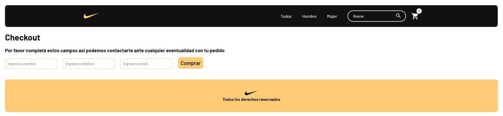
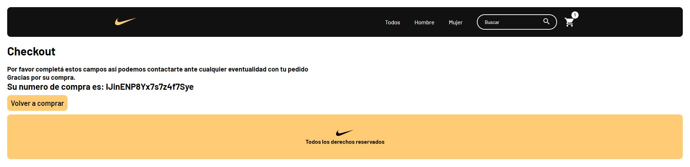

# Air Force One E-commerce
#### Lenguajes y/o librerias utilizadas:

## Un poquito de como se ve por dentro la web

#### Aca podes ver como es la vista cuando seleccionas un producto, se ven 6 imagenes más representativas de la zapatilla seleccionada y a su izquierda el detalle de las mismas con su precio, la cantidad de zapatillas de ese modelo seleccionadas para comprar, 2 botones para eliminar ese producto en especifico o vaciar si tenemos más de uno.

#### Luego vamos a poder agregar el o los productos al carrito, y ahi pasamos a la siguiente imagen

#### Una vez dentro del carrito podemos ver el detalle nuevamente de la o las zapatillas seleccionadas.

#### Podemos ver el precio de la o las mismas y una vez que estemos decididos a comprar, podemos darle a finalizar compra para poder pasar al checkout.

#### En el checkout nos va a pedir algunos datos los cuales tenemos que completar para poder avanzar con la compra.

#### Una vez dado a comprar nos va a entregar un codigo unico que es nuestro ID de compra el cual debemos guardar por cualquier inconveniente con la compra.

